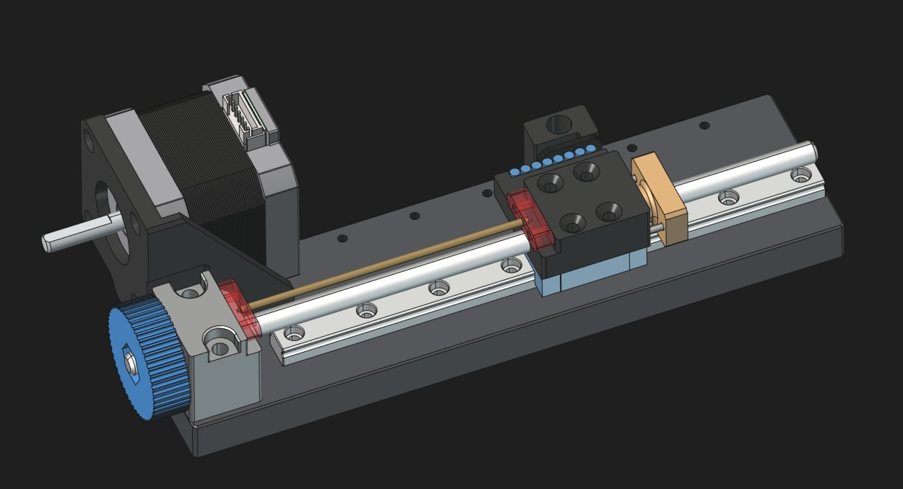

# Ball Joint Embossing Machine



> **Work in Progress** — This project is not in a finished, well-documented, or ready-to-replicate state. It is shared as a starting point for anyone who wants to build upon it. Expect incomplete documentation, rough edges, and parts that may require adaptation.

## Overview

A motorized linear embossing machine designed to precisely press ball joints. It was designed to automate the production of balljoint linkages for the [Open-Micro-Manipulator](https://github.com/0x23/MicroManipulatorStepper). It uses a NEMA 17 stepper motor driving a leadscrew on an MGN9 linear rail, with closed-loop position feedback from an MT6835 magnetic encoder. The tool head position is controlled in real time by firmware running on an RP2040 microcontroller.

[](https://youtu.be/NM2KXvRGmpg)


## Hardware

- **Microcontroller:** RP2040-ZERO / RP2350-ZERO
- **Motor:** NEMA 17 stepper (1.8°, 50 pole pairs)
- **Motor driver:** TB6612
- **Position sensor:** MT6835 magnetic encoder (SPI)
- **Linear guide:** MGN9 rail + carriage
- **Drive:** Leadscrew with 3 mm magnet pitch, 48/20 gear ratio

## Electronics

> **WARNING: The electronics must be powered by no more than 5 V. Supplying a higher voltage will risk damaging the USB port on your Computer.**

The custom controller board (`electronics/ControllerBoardSingle_v1/`) is designed around the RP2040-ZERO / RP2350-ZERO and the TB6612 dual motor driver. Open the project with KiCad 10 or later. There is alwas a physical button to start the embossing process - please look at the firmware for finding the correct pin.

## Firmware

The firmware is built with [PlatformIO](https://platformio.org/).

**Build & upload:**
```bash
cd firmware
pio run --target upload
```

**Linux note:** udev rules must be installed before the upload will work:
```bash
sudo curl -fsSL https://raw.githubusercontent.com/platformio/platformio-core/develop/platformio/assets/system/99-platformio-udev.rules \
  -o /etc/udev/rules.d/99-platformio-udev.rules
sudo service udev restart
# replug the device, then run pio run --target upload
```

## License

MIT — see [LICENSE](LICENSE) for the full text.